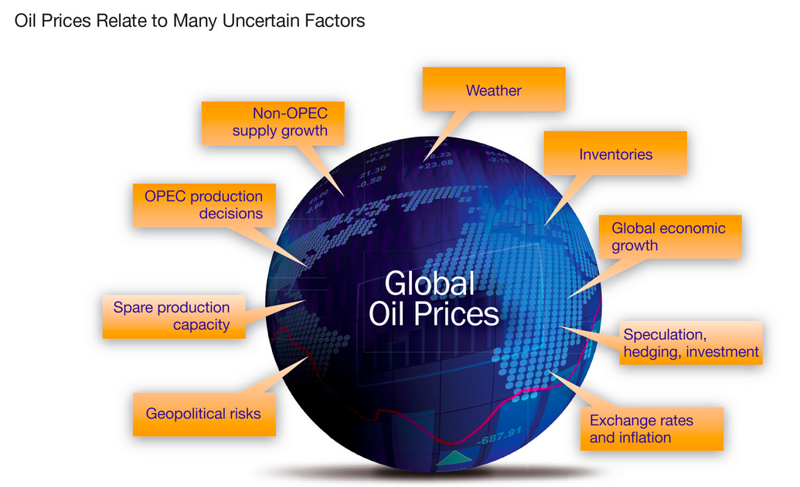
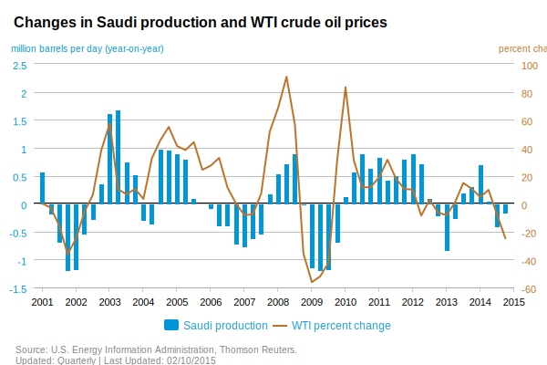
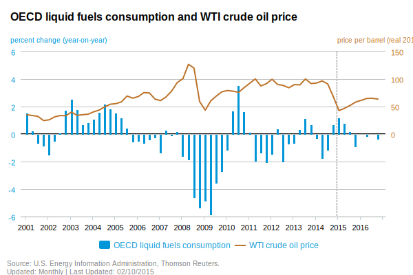
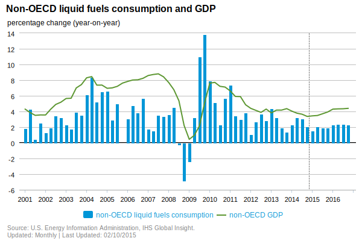
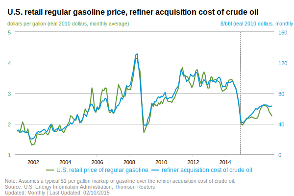
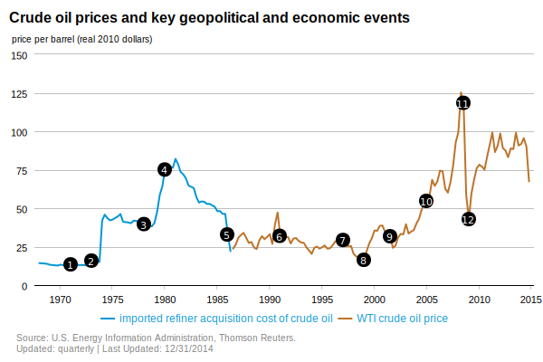
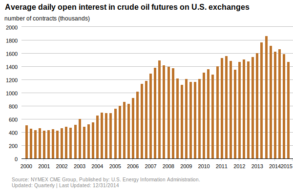
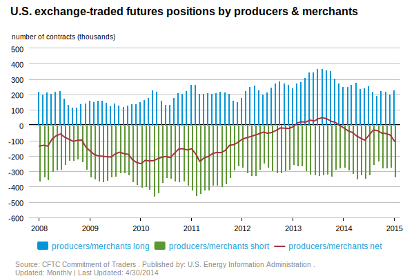
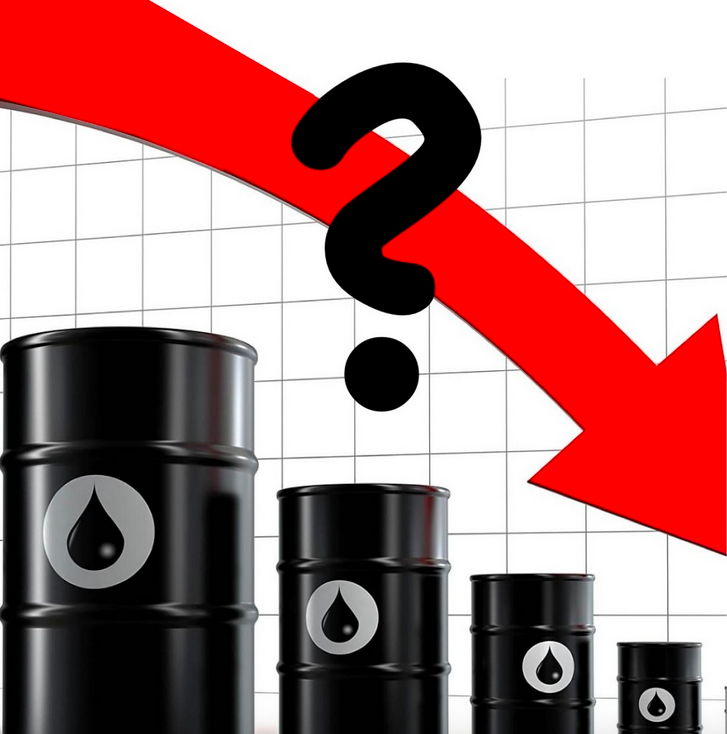

---
title: "OIL SHOW  HTML PROTOTYPE"
author: "ANYA ERIC JEFF JOHN"
date: "02/23/2015"
output:
  revealjs::revealjs_presentation:
    theme: sky
    transition: fade
    highlight: pygments
    center: true
    mathjax: null
    css: oil.css

---

```{r, echo=FALSE, eval=FALSE}
require(revealjs) || devtools::install_github("jjallaire/revealjs")
```


## WHAT AFFECTS OIL’s PRICES? 




## OPEC OIL SUPPLY 

-
Crude oil production by OPEC is an important factor that affects oil prices. OPEC seeks to actively manage oil production in its member countries by setting production targets. 

-
Historically, crude oil prices have seen increases in times when OPEC production targets are reduced. 




## OECD DEMAND  

-
OECD consists of the United States, much of Europe, and other advanced countries. At 53 percent of world oil consumption in 2010, these large economies consume more oil than non-OECD countries, with lower oil consumption growth



## Non_OECD OIL DEMAND

-
While oil consumption in the OECD countries declined between 2000 and 2010, non-OECD oil consumption increased more than 40 percent. 

-
China, India, and Saudi Arabia had the largest growth in oil non-OECD oil consumption during this period.



## SPOT PRICING

-
Petroleum product prices tend to move together with crude oil prices, with some variation due to seasonality, factors specific to the market for a particular product, or refining outages.



## EVENTS IMPACT ON OIL PRICING

-
Both crude oil and petroleum product prices can be affected by events that have the potential to disrupt the flow of oil and products to market, including geopolitical and weather-related developments




## Spot Prices 


## FINANCIAL MARKETS 

-
Market participants not only buy and sell physical quantities of oil, but also trade contracts for the future delivery of oil and other energy derivatives. One of the roles of futures markets is price discovery, and as such, these markets play a role in influencing oil prices. 




## OIL TRADING ON EXCHANGES 

-
The Commodity Futures Trading Commission publishes the activities of multiple trading categories, including physical participants (producers, merchants, processors, and end users), money managers (usually hedge funds or other sophisticated traders), and swap dealers (traditionally investment banks or commodity broker/dealers)

-


-----

## MONEY MANAGERS ARE CONSISTENTLY LONG ON OIL FUTURES

-
Money managers have been net long in their U.S. exchange-traded futures positions for the vast majority of the time since January of 2008. Their net long positions increased substantially during the recent period of unrest in the Middle East and North Africa.


-----

## WHY ARE OIL PRICES FALLING? 




## THE US ROLE: 

- 
BALANCE THE WORLD MARKET

_ 
GROW US MARKETSHARE 


