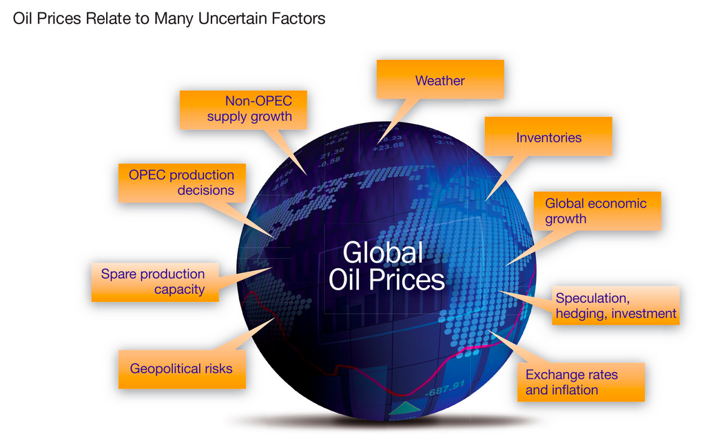
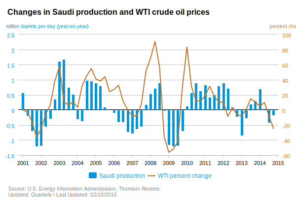
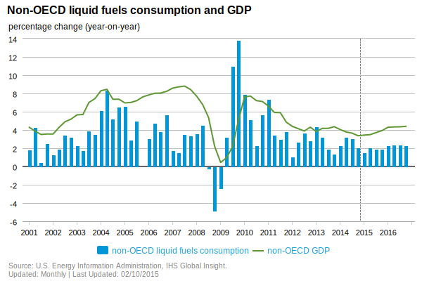
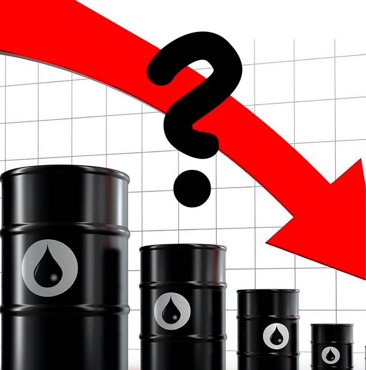

---
title: "OIL SHOW  HTML PROTOTYPE"
author: "ANYA ERIC JEFF JOHN"
date: "02/18/2015"
output:
  revealjs::revealjs_presentation:
    theme: sky
    transition: fade
    highlight: pygments
    center: true
    mathjax: null
---

```{r, echo=FALSE, eval=FALSE}
require(revealjs) || devtools::install_github("jjallaire/revealjs")
```

## WHAT AFFECTS OIL’s PRICES? 



## US MAP 


## SEVEN FACTORS THAT DRIVE OIL'PRICING ~ EAI.GOV


## OIL SUPPLY ~ SVG




## OECD DEMAND  ~ IMAGE


## NON_OECD DEMAND ~ IMAGE





## WORLD GDP ~ OIL DEMAND


## MARKET BEHAVIOR ~ Eric's Slide as an image


## Spot Prices ~ Eric's Slide as an image


## WHY IS THE PRICE FALLING? 



## WHAT DOES THE FUTURE HOLD? 


## OIL PRICE's 2016 FORECAST   


